# Disentangling the latent code for precise and meaningful control over chip data generation
> Which explores interpretable latent space directions of a pretrained GAN. Our code expands on this to explore interpretable latent space directions of different semantic classes. Furthermore, it explores different ways of training the latent deformator.

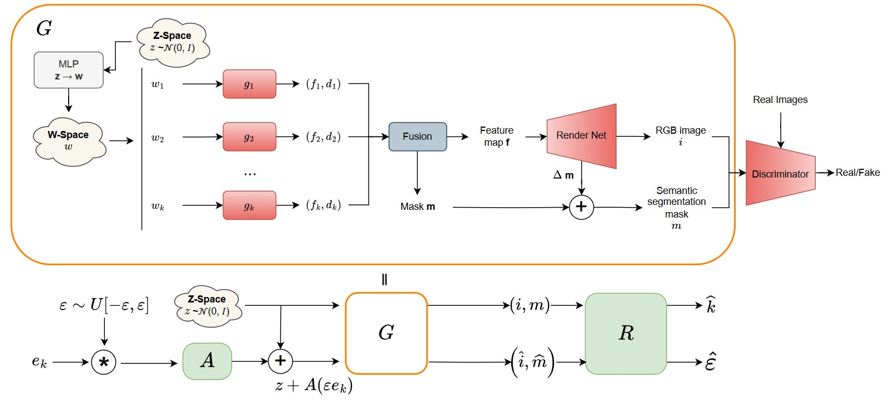

## Results 
Here is an example of compositional generation:

Here are examples of generated celebrity images, manipulated by moving along identified meaningful directions for the mouth class
| Mouth - Open Wide | Mouth -  Show teeth |
| -------- | -------- | 
| 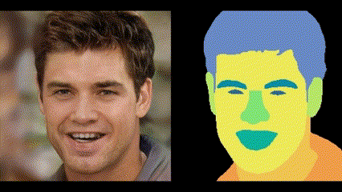| 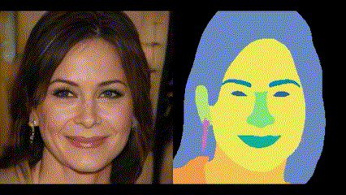 | 

| Mouth - Position | Mouth -  Lip Color | 
| -------- | -------- | 
| 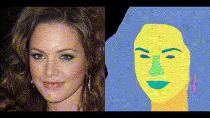| 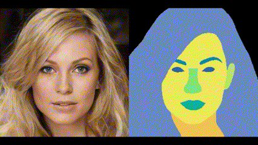| 

| Mouth - Smile Frown | Skin - masculine/feminine|
| -------- | -------- | 
| 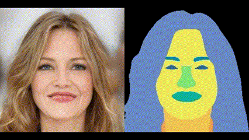 |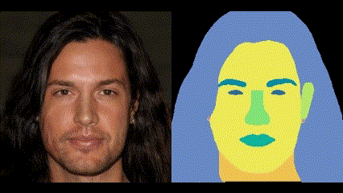| 

| Skin - Beard |Eyebrow - Down|
| -------- | -------- | 
| 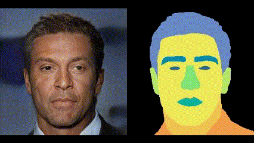| 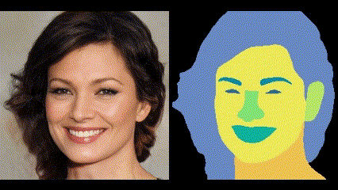| 

Here are examples of generated chip images, manipulated by moving along identified meaningful directions for various semantic classes:
| Background - Shift one side |Background - Vertical movement|
| -------- | -------- | 
| 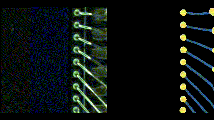| 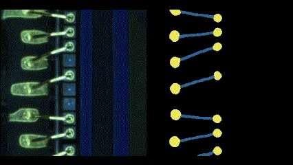| 

| Background - Change pad location |Background - Horizontal movement|
| -------- | -------- | 
| 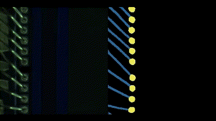| 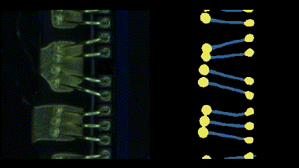| 

| Background - Brightness |Ball + wire - Ball horizontal movement|
| -------- | -------- | 
| 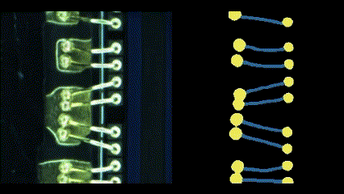| 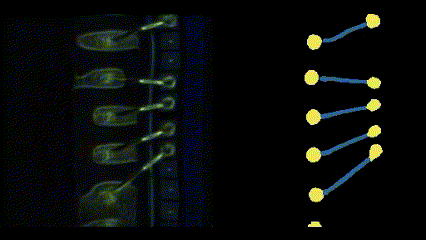| 

# Acknowledgments
This code is initialy built from [SemanticStyleGAN](https://github.com/seasonSH/SemanticStyleGAN) and from [GanLatentDiscovery](
https://github.com/anvoynov/GANLatentDiscovery).

## Credits

**SemanticStyleGAN model and implementation:**  
https://github.com/seasonSH/SemanticStyleGAN \
Copyright (C) 2022 ByteDance Inc.
CC BY-NC-SA 4.0 license https://github.com/seasonSH/SemanticStyleGAN/blob/main/LICENSES/LICENSE

**StyleGAN2 model and implementation:**  
https://github.com/rosinality/stylegan2-pytorch  
Copyright (c) 2019 Kim Seonghyeon  
License (MIT) https://github.com/rosinality/stylegan2-pytorch/blob/master/LICENSE  

**LPIPS model and implementation:**  
https://github.com/S-aiueo32/lpips-pytorch  
Copyright (c) 2020, Sou Uchida  
License (BSD 2-Clause) https://github.com/S-aiueo32/lpips-pytorch/blob/master/LICENSE  

**ReStyle model and implementation:**  
https://github.com/yuval-alaluf/restyle-encoder  
Copyright (c) 2021 Yuval Alaluf  
License (MIT) https://github.com/yuval-alaluf/restyle-encoder/blob/main/LICENSE  

**Please Note**: The CUDA files are made available under the [Nvidia Source Code License-NC](https://nvlabs.github.io/stylegan2/license.html)

